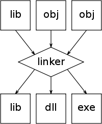

assemble, link, and run the code:

    $ nasm -f elf64 hello.asm
    $ ld -m elf_amd64_fbsd -o hello -s hello.o
    $ ./hello
    Hello, World!

http://www.freebsd.org/doc/en/books/developers-handbook/x86-portable-code.html

http://www.freebsd.org/doc/en/books/developers-handbook/x86-first-program.html

http://en.wikipedia.org/wiki/Executable_and_Linkable_Format

http://en.wikipedia.org/wiki/Ld_(Unix)
